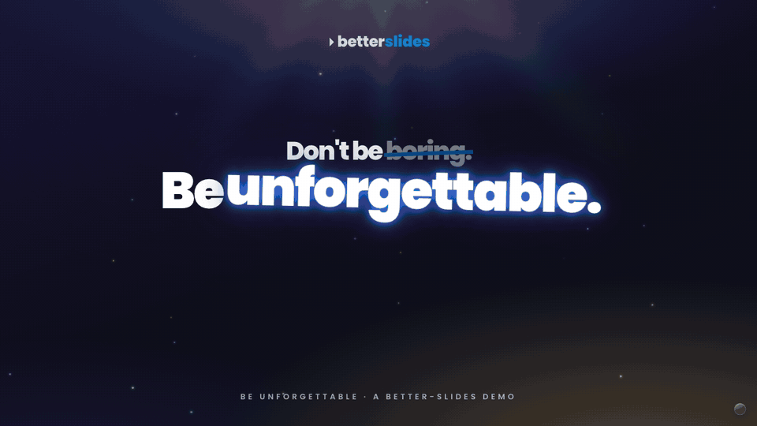
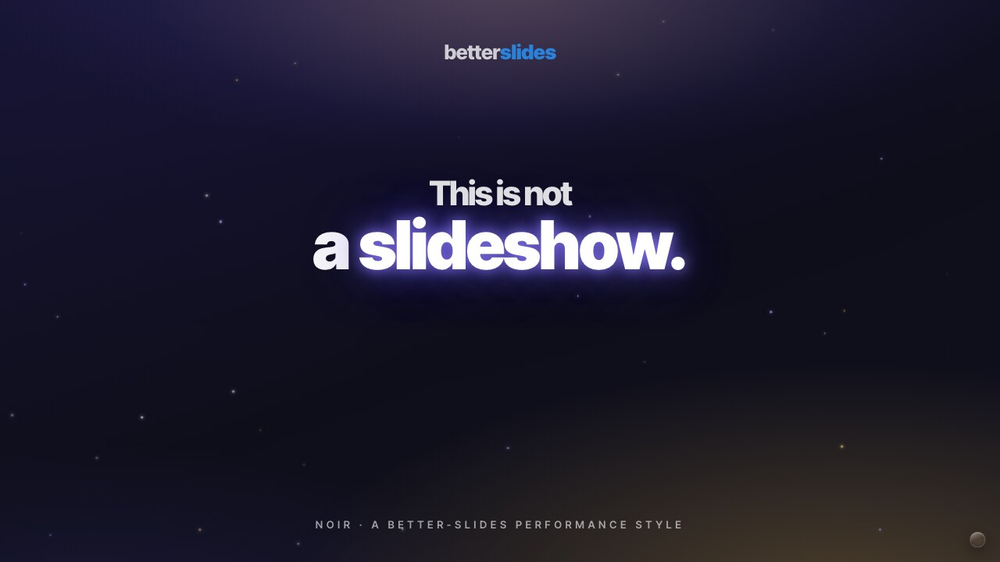

# better-slides

**Slides that *perform* — Apple-keynote theatrics in a single HTML file your coding agent writes for you.**

<sup>by <a href="https://github.com/hanley-tech">Hanley Leung</a> · <a href="https://hanley.world">hanley.world</a> · born from the LunaTechs Speaker Playbook</sup>

Most slide tools make a *document*. better-slides makes a *performance*: big type, timed
reveals, sound design, and a "one more thing" finale — the theatrics of an Apple keynote,
the openness of the web, authored by a coding agent, with a built-in methodology that
tells you **what to actually say**.

> Don't be boring. Be unforgettable.



**Live demos:** [Be Unforgettable (Spotlight)](https://hanley-tech.github.io/better-slides/demo/) · [This is not a slideshow (Noir)](https://hanley-tech.github.io/better-slides/demo/noir/) — arrow keys to advance, `m` for sound, `f` for fullscreen.

This is an agent skill (works with Claude Code and any coding agent that can read a repo
and run a shell). Point it at your talk; get back one portable `.html` file that opens in
any browser, scales to any screen, and runs entirely offline-ish (one fonts request).

---

## Why this exists

There's a gap nobody fills:

|                     | Theatrics | Open / web | AI-authored | Tells you what to say |
| ------------------- | :-------: | :--------: | :---------: | :-------------------: |
| **Apple Keynote**   |     ✅     |     ❌      |      ❌      |           ❌           |
| **reveal.js**       |     ~     |     ✅      |      ❌      |           ❌           |
| **AI slide tools**  |     ❌     |     ✅      |      ✅      |           ❌           |
| **better-slides**  |     ✅     |     ✅      |      ✅      |           ✅           |

Most AI slide generators optimize for *removing friction* and ship a static, pretty
document. better-slides optimizes for the opposite: a deck that's **felt** — that
applauds, swooshes, lands a reveal, and leaves the room itching to act.

## Built for the podium

Conference screens are a graveyard of mismatched resolutions and aspect ratios. Most decks
were authored for one screen and break on the rest — text reflows, a chart slips off the
edge, the hero number wraps. better-slides sidesteps the whole class of problem: the deck
is a **fixed composition** that scales and letterboxes, so it is pixel-identical on every
projector, every time. Plug in, present, don't think about it.

## What you get

- **Event-proof stage engine** — authored once at a fixed 1920×1080 and scaled as one unit
  to whatever screen the venue hands you: 1080p laptop, 4:3 hall projector, 16:10 panel,
  ultrawide, confidence monitor, phone. It **letterboxes instead of reflowing** — what you
  designed is exactly what shows, on every screen, with zero last-minute surprises at the
  podium. Keyboard / swipe / deep-link nav, glass control menu, progress bar.
- **The performance layer** — GSAP-driven timed reveals, staggered builds, and an
  `omt` ("one more thing") finale recipe. Optional **sound design**: applause beds,
  swooshes, chimes, and a live waveform — wired through the Web Audio API.
- **Performance styles** — full design systems (not just themes): typography, palette,
  motion grammar, and sound palette per style. Loaded progressively.
- **The Speaker Playbook** — a built-in *methodology* for what to put on stage: distill to
  one idea, narrative over data, one huge number, build a hero slide worth screenshotting,
  stick the landing. ([`playbook/speaker-playbook.md`](playbook/speaker-playbook.md))
- **Zero dependencies** — one HTML file (plus optional audio assets). Works in 10 years.
  No npm, no build step, no framework.

## The demos

[`demo/`](demo/) is the **"Be Unforgettable" talk** — the Speaker Playbook itself, rebuilt
on the better-slides engine with the full performance treatment (Spotlight style). It's the
worked example *and* the marketing: a talk about being unforgettable that is itself
unforgettable. ([live](https://hanley-tech.github.io/better-slides/demo/))

[`demo/noir/`](demo/noir/) is **"This is not a slideshow"** — a short launch keynote in the
**Noir** style: black stage, white light, one accent, held pauses, and the "one more thing"
finale. ([live](https://hanley-tech.github.io/better-slides/demo/noir/))



```bash
open demo/index.html        # Be Unforgettable (Spotlight)
open demo/noir/index.html   # This is not a slideshow (Noir)
```

## Install

### Claude Code — marketplace

```text
/plugin marketplace add https://github.com/hanley-tech/better-slides
```

then, as a separate message:

```text
/plugin install better-slides@better-slides
```

Use it with `/better-slides:better-slides`.

### Claude Code — manual skill

```bash
git clone https://github.com/hanley-tech/better-slides.git ~/.claude/skills/better-slides
```

Then use it by typing `/better-slides`.

### Any other coding agent

Send the agent this repo link and ask it to use the better-slides skill. It should start
from [`SKILL.md`](SKILL.md) and load only the supporting files it references.

## How it works

1. **Brief** — purpose, length, and *register* (speaker-led vs. reading), plus your
   content (or just a topic).
2. **Method pass** — the agent applies the Speaker Playbook: finds your one idea, your
   hero slide, your landing.
3. **Style** — pick a performance style from generated live previews.
4. **Build** — one self-contained HTML deck, themed, with the motion and (optionally)
   sound layer wired in.
5. **Perform / share** — open it, present it, deploy it, or export a PDF.

## Architecture (progressive disclosure)

| File | Purpose | Loaded when |
| --- | --- | --- |
| [`SKILL.md`](SKILL.md) | Core workflow + invariants | Always |
| [`playbook/speaker-playbook.md`](playbook/speaker-playbook.md) | What to say — the methodology | Phase 1 (content) |
| [`performance-styles/selection-index.json`](performance-styles/selection-index.json) | Compact style metadata | Phase 2 (style) |
| `performance-styles/*/preview.md` | Title-slide preview cards | Phase 2 (shortlist) |
| `performance-styles/*/design.md` | Full design system for the chosen style | Phase 3 (generate) |
| [`engine/template.html`](engine/template.html) | Base deck (stage + nav + chrome) | Phase 3 |
| [`engine/stage.css`](engine/stage.css) | Mandatory fixed-stage CSS | Phase 3 |
| [`reference/layouts.md`](reference/layouts.md) | Slide recipes | Phase 3 |
| [`reference/motion.md`](reference/motion.md) | Timed-reveal / GSAP / `omt` patterns | Phase 3 |
| [`reference/audio.md`](reference/audio.md) | Sound design + Web Audio wiring | Phase 3 (if sound) |
| [`reference/theming.md`](reference/theming.md) | Token swap | Phase 3 |

## Philosophy

1. **A deck is a performance, not a document.** Optimize for what the room *feels*.
2. **One idea, said in one breath.** If it doesn't fit in a breath, it isn't one idea yet.
3. **The hero slide does the spreading.** Build one visual worth photographing.
4. **Dependencies are debt.** One HTML file works forever.
5. **Tell them what to say, not just how it looks.** Design without a point of view is slop.

## Credits

By [Hanley Leung](https://github.com/hanley-tech) ([hanley.world](https://hanley.world)) / [LunaTechs](https://lunatechs.social).
Engine extracted from the LunaTechs Speaker Playbook deck.

## License

MIT — use it, modify it, share it.
